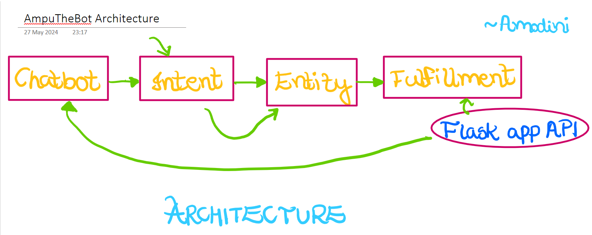

# AmpuTheBot - Currency Converter Chatbot

Welcome to the Currency Converter Chatbot project! This chatbot, built using Dialogflow and Flask API, allows users to easily convert currencies through natural language interactions.

## Overview

The Currency Converter Chatbot leverages the power of Dialogflow for Natural Language Understanding (NLU) to interpret user inputs and respond accordingly. By using Dialogflow, you can create highly interactive and responsive chatbots that understand and process natural language.

## Features

- **Currency Conversion**: Convert between various currencies using real-time exchange rates.
- **Natural Language Processing**: Understands user queries and provides accurate responses.
- **Interactive UI**: ngrok provides a real-time web UI to monitor HTTP traffic running over the tunnels.

## Technologies Used

- **Dialogflow**: For building the chatbot and providing NLU capabilities.
- **Flask API**: For fetching real-time currency exchange rates.
- **ngrok**: To create secure tunnels to localhost, providing a real-time web UI to manage HTTP traffic.

